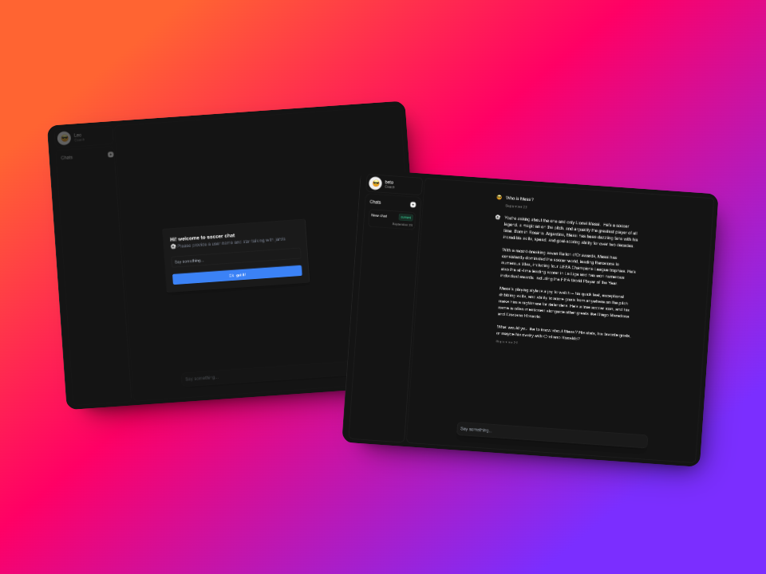

# ⚽️ Soccer Chatbot



This repository contains the source code for a soccer chatbot application. The chatbot provides information and answers related to soccer.

You can try the app here: [soccer chat](https://chat-test-gules.vercel.app/)

## Getting Started

To get started with the development and running of this application, follow the instructions below.

### Prerequisites

Ensure you have Node.js v18 or greatter installed on your machine. This project uses npm as the package manager.

This project user a Groq API KEY for the AI model and also use Suapabse for Database.

```bash
# Create a groq api key at https://groq.com/

# Create a supabase project at https://app.supabase.io/
```


### Installation

Clone the repository and install the dependencies:

```bash
git clone https://github.com/betotorodev/chat-test.git
cd chat-test
npm install
```

### Scripts

The following npm scripts are available for development:

#### Development

To start the development server, run:

```bash
npm run dev
```

This will start the Next.js development server.

#### Testing

To run the tests, use:

```bash
npm test
```

This will execute the tests using Vitest.

## License

This project is licensed under the MIT License. See the LICENSE file for details.

## Acknowledgments

- Next.js
- Vitest
- React
- Supabase
- Tremor

For any questions or issues, please open an issue in this repository. 
And you can follow me on Twitter (x): [betotorodev](https://twitter.com/betotorodev)

Made with love by beto ♥️
